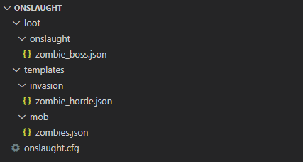

# Example

Here is an example of a full, working invasion with an initial wave of zombies, a second wave of zombie reinforcements, and a final, named boss zombie.

## File Locations



## loot/onslaught/zombie_boss.json

```js
{
  "pools": [
    {
      "rolls": 1,
      "entries": [
        {
          "type": "item",
          "name": "minecraft:rotten_flesh",
          "weight": 1,
          "functions": [
            { "function": "set_count", "count": { "min": 4, "max": 8 } },
            { "function": "looting_enchant", "count": { "min": 0, "max": 1 } }
          ]
        }
      ]
    },
    {
      "conditions": [{ "condition": "killed_by_player" }],
      "rolls": 1,
      "entries": [
        { "type": "item", "name": "minecraft:iron_helmet", "weight": 1 },
        { "type": "item", "name": "minecraft:iron_chestplate", "weight": 1 }
      ]
    },
    {
      "conditions": [{ "condition": "killed_by_player" }],
      "rolls": 1,
      "entries": [
        { "type": "item", "name": "minecraft:iron_leggings", "weight": 1 },
        { "type": "item", "name": "minecraft:iron_boots", "weight": 1 }
      ]
    },
    {
      "conditions": [{ "condition": "killed_by_player" }],
      "rolls": 1,
      "entries": [{ "type": "item", "name": "minecraft:shield", "weight": 1 }]
    }
  ]
}
```

## templates/invasion/zombie_horde.json

```js
{
  "zombie": {
    "name": "Zombie Horde",
    "selector": {
      "weight": 1,
      "dimension": {
        "type": "include",
        "dimensions": [0]
      }
    },
    "messages": {
      "start": "A horde of zombies appear!",
      "end": "The zombie horde has been neutralized!",
      "warn": {
        "ticks": 12000,
        "message": "The faint smell of zombie flesh hangs in the morning air..."
      }
    },
    "waves": [
      {
        "delayTicks": [0],
        "groups": [
          {
            "weight": 1,
            "forceSpawn": true,
            "mobs": [
              {
                "id": "zombie",
                "count": [12, 16],
                "spawn": {
                  "type": "ground",
                  "light": [0, 7],
                  "rangeXZ": [16, 32]
                }
              }
            ]
          }
        ]
      },
      {
        "delayTicks": [1800, 2400],
        "groups": [
          {
            "weight": 1,
            "forceSpawn": true,
            "mobs": [
              {
                "id": "zombie_reinforcement_00",
                "count": [8, 12],
                "spawn": {
                  "type": "ground",
                  "light": [0, 15],
                  "rangeXZ": [16, 32]
                }
              }
            ]
          },
          {
            "weight": 1,
            "forceSpawn": true,
            "mobs": [
              {
                "id": "zombie_reinforcement_01",
                "count": [8, 12],
                "spawn": {
                  "type": "ground",
                  "light": [0, 15],
                  "rangeXZ": [16, 32]
                }
              }
            ]
          }
        ]
      },
      {
        "delayTicks": [3600],
        "groups": [
          {
            "weight": 1,
            "forceSpawn": true,
            "mobs": [
              {
                "id": "zombie_boss",
                "count": [1],
                "spawn": {
                  "type": "ground",
                  "light": [0, 15],
                  "rangeXZ": [16, 24]
                }
              }
            ]
          }
        ]
      }
    ]
  }
}
```

## templates/mob/zombies.json

```js
{
  "zombie": {
    "id": "minecraft:zombie"
  },
  "zombie_reinforcement_00": {
    "id": "minecraft:husk",
    "nbt": {
      "HandItems": [
        { "Count": 1, "id": "minecraft:wooden_sword" },
        { "Count": 1, "id": "minecraft:shield" }
      ],
      "HandDropChances": [0.0, 0.0],
      "ForgeData": {
        "Onslaught": {
          "CustomAI": {
            "CounterAttack": { "Chance": 0.2 }
          }
        }
      }
    }
  },
  "zombie_reinforcement_01": {
    "id": "minecraft:zombie",
    "nbt": {
      "ArmorItems": [
        { "Count": 1, "id": "minecraft:leather_boots" },
        { "Count": 1, "id": "minecraft:leather_leggings" },
        { "Count": 1, "id": "minecraft:leather_chestplate" },
        { "Count": 1, "id": "minecraft:leather_helmet" }
      ],
      "ArmorDropChances": [0.0, 0.0, 0.0, 0.0],
      "ForgeData": {
        "Onslaught": {
          "CustomAI": {
            "Lunge": { "Range": 6, "SpeedModifier": 0.3 }
          }
        }
      }
    }
  },
  "zombie_boss": {
    "id": "minecraft:husk",
    "effects": [
      {
        "id": "minecraft:strength",
        "duration": 4800,
        "amplifier": 0,
        "showParticles": true
      }
    ],
    "extraLootTables": ["onslaught:zombie_boss"],
    "nbt": {
      "CustomName": "Bob Zombie",
      "HandItems": [
        { "Count": 1, "id": "minecraft:iron_sword" },
        { "Count": 1, "id": "minecraft:shield" }
      ],
      "HandDropChances": [0.0, 0.0],
      "ArmorItems": [
        { "Count": 1, "id": "minecraft:iron_boots" },
        { "Count": 1, "id": "minecraft:iron_leggings" },
        { "Count": 1, "id": "minecraft:iron_chestplate" },
        { "Count": 1, "id": "minecraft:iron_helmet" }
      ],
      "ArmorDropChances": [0.0, 0.0, 0.0, 0.0],
      "ForgeData": {
        "Onslaught": {
          "CustomAI": {
            "CounterAttack": { "Chance": 0.2 },
            "Lunge": { "Range": 6, "SpeedModifier": 0.3 },
            "Mining": { "Range": 4, "SpeedModifier": 1 }
          }
        }
      }
    }
  }
}
```