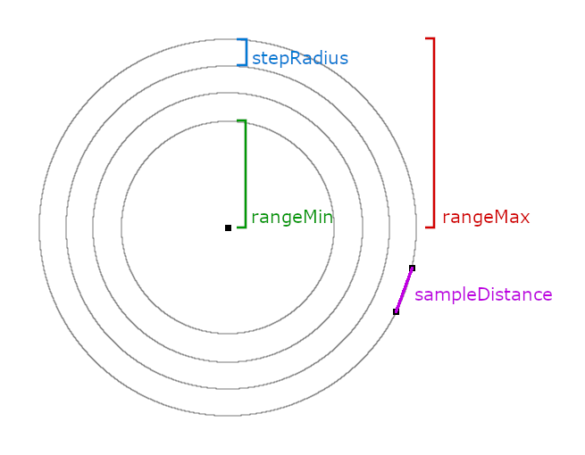

# Overview

To help you design your invasions, here is some information on how the systems work.

## Invasions

All timers operate relative to the Overworld's clock.

Players are randomly assigned a timer value based on the config values and flagged as `waiting`.

A player's timer will only count down while they are online.

When a player's timer expires, they are flagged as `eligible` for an invasion.

Between the time `6:00` and `7:00` (`0` and `1000` ticks), `N` players are selected from the `eligible` queue, up to the configured max concurrent invasion value. A player's invasion is selected and any instanced data is saved to the player at this time. The player is removed from the `eligible` queue and flagged as `pending` with an invasion start timestamp for `19:00` (`13000` ticks) that night.

While the player is `pending`, the message system will track and send the early warning message if applicable.

When the time passes a `pending` player's timestamp, they are flagged as `active`. Start messages are sent and start commands are executed.

The wave spawner will notice an `active` player and attempt to spawn waves. It will attempt to keep the number of remaining mobs spawned near the player. If the spawner can't spawn a mob, it will attempt to use the delayed-spawn system which will show particles where the mobs will spawn for a time before spawning the mobs in lit areas. If the delayed-spawn is disabled or otherwise fails, the system will try to spawn the secondary mob.

When an invasion mob dies, the invasion data is updated and staged commands are checked and executed.

If a player has no active mobs, the next wave will start immediately.

When all of the requisite mobs belonging to an invasion have been eliminated, the player is flagged as `waiting` and assigned a new timer value. Any end messages are sent and end commands are executed at this time.

## Spawn Sampler

The spawner algorithm samples equidistant XZ points on a circle at the maximum range from the player, then progressively moves inward and samples equidistant points from smaller circles until the minimum range is reached.

Each sampled XZ point originates at the player's Y location and a pillar of blocks is evaluated, truncating in each vertical direction when the vertical range parameter is exceeded.

The algorithm is basically this:

1. Derive the angle needed to achieve the required sample distance
2. Step around the circle, incrementing with the derived angle and collect all the angles
3. Shuffle the angle collection and step through the points for each angle
4. Evaluate the pillar and if a valid location is found, stop and return it
5. Shrink the circle by the step radius 
6. If the new circle radius is within bounds, go to 1, else stop and return null

The algorithm allows for quite a bit of control, including the minimum and maximum range, the step radius -- the distance between sample circles -- and the distance between sampled points. It will always prioritize locations that are farthest from the player, before moving to closer locations, and because the sample density can be controlled, it doesn't need to evaluate all possible locations to get reasonably good coverage. Finally, unlike the first approach, it allows early-out termination when a valid spawn location is found.

A worst-case scenario can still play out when no valid spawn locations are found, but the performance impact is mitigated by not sampling every possible location. This can be further mitigated by timing each spawn and, when spawning exceeds a maximum time limit, deferring the remaining spawns by two ticks, skipping one tick to let the game catch up before spawning again.

Using a fixed, linear distance between sample points ensures a more even distribution of points as opposed to having the points grow more dense closer to the player and less dense farther away.